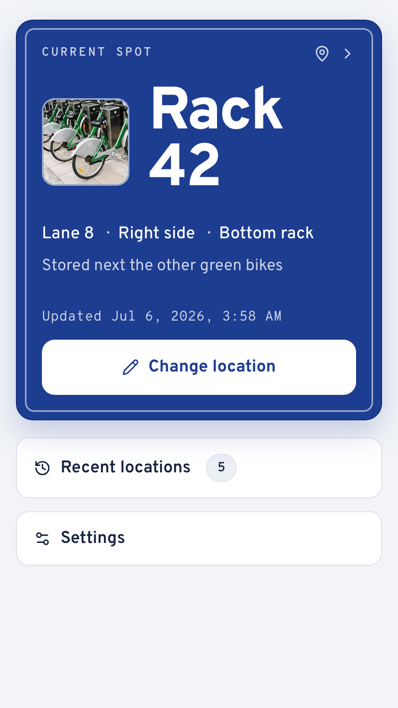
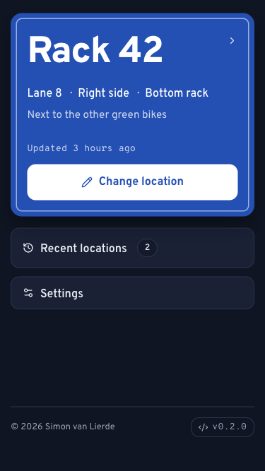
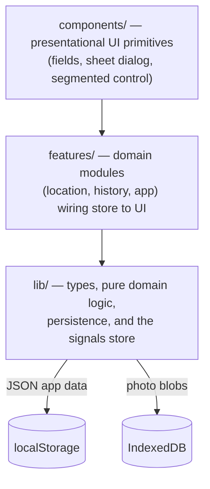

# Bikespot

[](https://github.com/simonvanlierde/bikespot/actions/workflows/ci.yml)
[](https://codecov.io/gh/simonvanlierde/bikespot)
[](https://bikespot.duinlab.nl)
[](LICENSE)
[](https://bikespot.duinlab.nl)

An offline-first PWA for remembering where you parked your bike. Everything stays on your device — no account, no server.

<!--
Screenshots TODO: capture per docs/README.md, commit to docs/screenshots/,
then delete these comment markers to make the table live.
| Light | Dark |
| --- | --- |
|  |  |
-->
> **Screenshots pending** — see [`docs/README.md`](docs/README.md#screenshots--todo-needs-real-captures).

## Features

- **Save your spot** as a structured *station* location (lane, side, rack level, distance, floor, rack number) or a free-text *outside* description.
- **Optional GPS coordinates, photos and notes** attached to any spot.
- **Recent history** of your last five spots, each restorable as the current one.
- **Configurable station** — name, lane-input style, lane labels, visible fields, and default floor.
- **Installable and offline** via a generated service worker and web manifest.

By design, the app is single-device: no cross-device sync. State lives in `localStorage`; photos live in IndexedDB.

## Roadmap

- [ ] Add a map view for saved spots.
- [ ] Consider server-side sync for multi-device support, with optional end-to-end encryption.

## Install

Bikespot runs in the browser and installs as an app — no app store needed.

1. Open **[bikespot.duinlab.nl](https://bikespot.duinlab.nl)**.
2. Add it to your home screen:
   - **iOS (Safari):** Share → *Add to Home Screen*
   - **Android (Chrome):** menu (⋮) → *Install app*
   - **Desktop (Chrome/Edge):** install icon in the address bar

Once installed it works offline, and all data stays on your device.

## Tech stack

Preact + `@preact/signals`, TypeScript, Vite, `vite-plugin-pwa` (Workbox), Biome, and Vitest. Managed with pnpm.

## Architecture

The app is a small client-only PWA with a three-layer `src/` structure and a single global store:



State is a set of `@preact/signals` in [`lib/store.ts`](src/lib/store.ts). UI reads signals directly; updates go through **pure functions** in [`lib/domain.ts`](src/lib/domain.ts) rather than in-place mutation, and an `effect()` persists the `data` signal whenever it changes. There is no router — navigation is modal state, modelled as the `OverlayState` discriminated union and rendered by [`features/app/AppOverlays.tsx`](src/features/app/AppOverlays.tsx). Persistence is split: structured app data in `localStorage` ([`lib/repository.ts`](src/lib/repository.ts)) and photos in IndexedDB with an in-memory fallback ([`lib/photos.ts`](src/lib/photos.ts)) — the reasoning is recorded in [ADR 0001](docs/adr/0001-split-persistence-across-localstorage-and-indexeddb.md).

## Development

Requires Node.js 24 and pnpm.

```bash
pnpm install
pnpm dev      # start the dev server
pnpm check    # lint, test, and build
```

`pnpm build` outputs a static site to `dist/`, deployable to any static host.

Released under the [MIT License](LICENSE).
